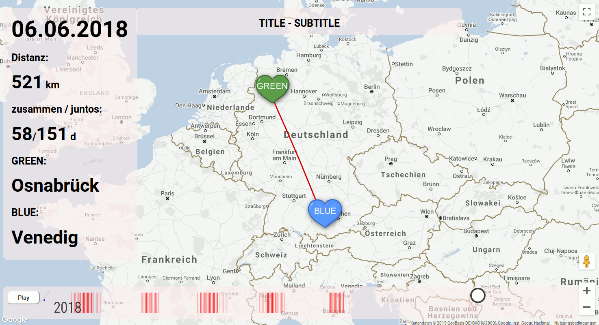

# Distance Visualisation for two people

This tool visualises the locations and distances of two individual travelers over time.
- It uses the Google Maps API as ground data and plots the locations as hearts (see history) into the map.
- This can then be played as animation with appropriate zoom levels or interacted with by using the slider of the time point.
  - The speeds vary for days spend at home and on traveling location such that the travels are streched in time

- With colors the distance (red for far away) is also displayes as heatmap beneath the slider.

- At the left panel the locations and distances are displayed together with the days wich where spend together by the two people.

## History
This is tool I wrote as a wedding gift for two of my friends.
During their years-long journey towards their wedding they traveled a lot.
This tool visualised this journey and gave a non linear overview of their time together and apart whereever tey were.

## Usage

1. Open `animatePins_google.html` as text file and optionally edit `GREEN`, `BLUE`, `TITLE` etc. and insert your Google Maps API key at the bottom where it says `__APIKEY__`.
2. Look into the files `data/locations.csv`, `data/green.csv`, `data/blue.csv` and insert your data.
3. Open `animatePins_google.html` in a webbrowser
4. At the bottom load the data from [2] you want to visualize into the programm with the buttons for `Locations`, `GREEN`, `BLUE`
5. Adjust how many ticks per day for home locations (fast) and remote locations (slow) sould pass and how long a travel should last on average in ticks.
6. Hit `generate Data` and you will see a timeline and can hit `Play`.
7. You can always adjust the speed in ticks/second, the map style (default or silver-green) or reset your settings (also loaded data)

### Data

You need to manually generate your data into the three given files.

#### Personal travel file (GREEN.csv, BLUE.csv)
For each of the two people there has to be .csv file separeted by semicola and containing the following data:

| Field                   | Description  |
|:----------------------- |:------------ |
| `destination_name`      | Name of the destination |
| `lat`                   | latitudinal position in format 2.000101 (optional if `locations.csv` is given)  |
| `lng`                   | longitudinal position in format 2.000101 (optional if `locations.csv` is given)  |
| `arrival_date`          | arrival data at destination  |
| `departure_date`        | departure data from destination  |
| `default_after_location`| destination where the person is normally located (home) after (optional if previously given and not changed)  |
| `display_name`          | optional alternative display name to `destination_name` e.g. "Conference" instead of "Trento"  |

#### Locations file
In this file a list of all destinations and their locations can be given to shorten the personal travel file:
Name;lng;lat;lng

| Field                  | Description  |
|:---------------------- |:------------ |
| `destination_name`     | Name of the destination |
| `lng`                  | longitudinal position in format 2.000101 
| `lat`                  | latitudinal position in format 2.000101 
| `lng`                  | longitudinal position in format 2.000101 again?!

## ToDo
- unfortunately the `start` and `end` date has to be manually given to the `pinControl.js`
- there is an error in counting together-days if the displayed name is different but location is the same.
- `default_after_location` is not an optimal solution
